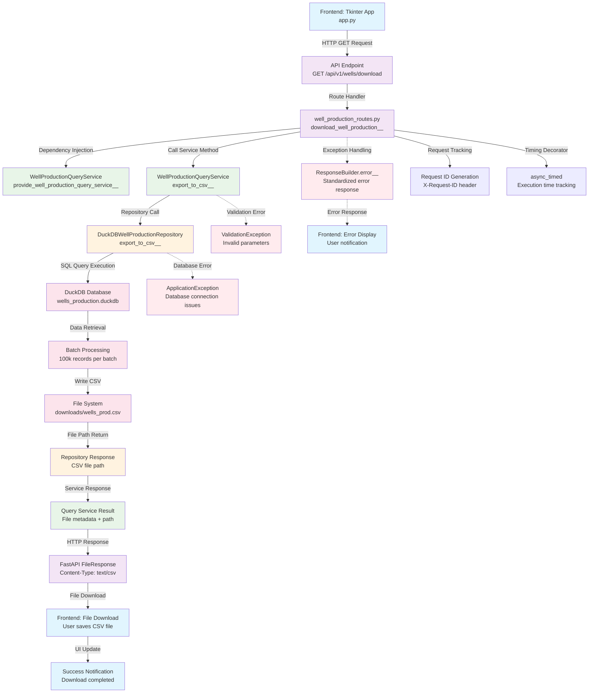

# CSV Export Workflow - GET /api/v1/wells/download

This workflow shows the complete flow for exporting well production data as CSV, from API endpoint to frontend download.

## Endpoint-Driven Flow Diagram

## Detailed Method Flow

### 1. API Endpoint Entry Point
- **File**: `src/interfaces/api/well_production_routes.py`
- **Method**: `download_well_production__`
- **Decorators**: `@router.get()`, `@async_timed`
- **Dependencies**: `WellProductionQueryService`

### 2. Service Layer Processing
- **File**: `src/application/services/well_production_query_service.py`
- **Method**: `export_to_csv()`
- **Functionality**: Coordinates CSV export process
- **Error Handling**: Wraps repository calls with service-level exception handling

### 3. Repository Layer Data Access
- **File**: `src/infrastructure/repositories/duckdb_well_production_repository.py`
- **Method**: `export_to_csv()`
- **Key Features**:
  - Batch processing (100k records per batch)
  - Memory management (6GB limit)
  - Parallel processing (4 threads)
  - Temporary file handling

### 4. Database Operations
- **Technology**: DuckDB
- **File**: `data/wells_production.duckdb`
- **Query Execution**: Bulk SELECT with optimized pagination
- **Performance**: Streaming results to avoid memory overflow

### 5. Frontend Response Handling
- **File**: `frontend/app.py`
- **Class**: `ApiModel`
- **Method**: `download_csv()`
- **UI Updates**: Progress indication and download completion notification

## Performance Characteristics

- **Batch Size**: 100,000 records per batch
- **Memory Limit**: 6GB allocation
- **Thread Count**: 4 parallel threads
- **File Format**: CSV with headers
- **Download Location**: User-selectable via file dialog

## Error Scenarios

1. **Database Connection Failure**: Returns ApplicationException
2. **File System Errors**: Handles permissions and disk space issues
3. **Memory Exhaustion**: Automatic batch size reduction
4. **Network Timeouts**: Frontend timeout handling (30 seconds)
5. **Validation Errors**: Parameter validation at API level
