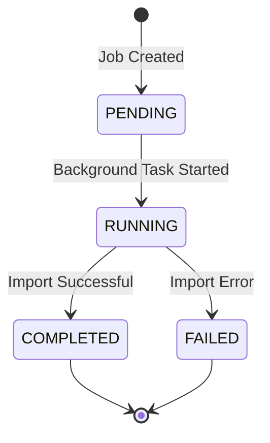

# Import Trigger Workflow - GET /api/v1/wells/import/trigger

This workflow shows the asynchronous import trigger system that allows starting imports via GET request with background job processing and status tracking.

## Endpoint-Driven Flow Diagram

```mermaid
graph TD
    A[Frontend: Tkinter App<br/>app.py] -->|HTTP GET Request| B[API Endpoint<br/>GET /api/v1/wells/import/trigger]
    
    B -->|Route Handler| C[well_production_routes.py<br/>trigger_import_well_production__]
    
    C -->|Job Management| D[JobManager<br/>create_job__]
    
    D -->|Check Existing Jobs| E[Job Status Check<br/>Prevent concurrent imports]
    
    E -->|Job Creation| F[New Job Instance<br/>Unique job_id generated]
    E -.->|Import In Progress| G[BusinessRuleViolationException<br/>SINGLE_IMPORT_RULE]
    
    F -->|Background Task| H[asyncio.create_task__<br/>run_import__]
    
    H -->|Immediate Response| I[HTTP 200 Response<br/>Job ID returned]
    
    I -->|Frontend Update| J[UI: Import Started<br/>Job ID displayed]
    
    %% Background Processing Flow
    H -->|Background Execution| K[run_import__ Function<br/>Background processing]
    
    K -->|Job Status Update| L[JobManager.update_job__<br/>Status: RUNNING]
    
    K -->|Service Call| M[WellProductionImportService<br/>import_production_data__]
    
    M -->|External API Call| N[ExternalApiAdapter<br/>fetch_well_production_data__]
    
    N -->|Data Processing| O[Batch Processing<br/>Memory-optimized chunks]
    
    O -->|Database Operations| P[DuckDBWellProductionRepository<br/>batch_insert__]
    
    P -->|Results Aggregation| Q[Import Results<br/>Success/failure counts]
    
    Q -->|Job Completion| R[JobManager.update_job__<br/>Status: COMPLETED]
    
    %% Status Polling Flow
    J -->|Status Polling| S[Frontend Polling<br/>GET /import/status/{job_id}]
    
    S -->|Status Request| T[API Endpoint<br/>GET /api/v1/wells/import/status/{job_id}]
    
    T -->|Job Lookup| U[JobManager.get_job_status__<br/>Retrieve job details]
    
    U -->|Status Response| V[Job Status Data<br/>Progress, timing, results]
    
    V -->|UI Update| W[Frontend: Progress Display<br/>Real-time status updates]
    
    %% Error Handling in Background
    M -.->|Processing Error| X[Exception in Background<br/>Import failure]
    X -.->|Error Handling| Y[JobManager.update_job__<br/>Status: FAILED]
    Y -.->|Error Status| Z[Frontend: Error Display<br/>Failure notification]
    
    %% Business Rule Violation
    G -.->|Error Response| AA[ResponseBuilder.error__<br/>Concurrent import prevention]
    AA -.->|Error Display| BB[Frontend: Error Message<br/>Import already running]

    %% Job Lifecycle Management
    L -->|Job Tracking| CC[Job Metadata<br/>started_at, total_records]
    R -->|Final Metrics| DD[Job Results<br/>completed_at, statistics]
    
    %% Styling
    classDef frontend fill:#e1f5fe
    classDef api fill:#f3e5f5
    classDef service fill:#e8f5e8
    classDef repository fill:#fff3e0
    classDef database fill:#fce4ec
    classDef error fill:#ffebee
    classDef background fill:#f1f8e9
    classDef job fill:#fff8e1
    
    class A,J,S,W,BB,Z frontend
    class B,C,I,T,AA api
    class M service
    class P repository
    class N,O background
    class D,E,F,K,L,R,U,V,CC,DD job
    class G,X,Y error
```

## Detailed Method Flow

### 1. API Endpoint Entry Point
- **File**: `src/interfaces/api/well_production_routes.py`
- **Method**: `trigger_import_well_production()`
- **HTTP Method**: GET (for simplicity)
- **Features**:
  - Immediate response with job ID
  - Background task creation
  - Concurrent import prevention

### 2. Job Management System
- **File**: `src/shared/job_manager.py`
- **Class**: `JobManager`
- **Key Methods**:
  - `create_job()`: Generate new job with unique ID
  - `update_job()`: Update job status and metadata
  - `get_job_status()`: Retrieve current job information
- **Business Rules**:
  - Only one import job can run at a time
  - Job IDs are unique UUIDs
  - Job history is maintained

### 3. Background Processing
- **Function**: `run_import()`
- **Execution**: Asynchronous background task
- **Features**:
  - Job status tracking throughout process
  - Error handling and recovery
  - Result aggregation and storage

### 4. Status Polling System
- **File**: `src/interfaces/api/well_production_routes.py`
- **Method**: `get_import_status()`
- **Features**:
  - Real-time job status retrieval
  - Execution time calculation
  - Progress percentage reporting

### 5. Frontend Job Tracking
- **File**: `frontend/app.py`
- **Features**:
  - Automatic status polling
  - Progress bar updates
  - Completion notifications

## Job Status States

### Job Lifecycle


### Job Data Structure
```json
{
  "job_id": "550e8400-e29b-41d4-a716-446655440000",
  "status": "COMPLETED",
  "created_at": 1704067200.123,
  "started_at": 1704067201.456,
  "completed_at": 1704067245.789,
  "execution_time_seconds": 44.333,
  "total_records": 150000,
  "new_records": 145000,
  "duplicate_records": 5000,
  "failed_records": 0,
  "error": null
}
```

## API Response Examples

### Successful Job Creation
```json
{
  "success": true,
  "data": {
    "job_id": "550e8400-e29b-41d4-a716-446655440000"
  },
  "message": "Import started successfully",
  "request_id": "req_abc123",
  "timestamp": "2024-01-01T12:00:00Z"
}
```

### Concurrent Import Prevention
```json
{
  "success": false,
  "error": {
    "code": "BUSINESS_RULE_VIOLATION",
    "message": "An import is already in progress. Please wait for it to complete.",
    "rule": "SINGLE_IMPORT_RULE"
  },
  "request_id": "req_def456",
  "timestamp": "2024-01-01T12:01:00Z"
}
```

### Job Status Response
```json
{
  "success": true,
  "data": {
    "job_id": "550e8400-e29b-41d4-a716-446655440000",
    "status": "RUNNING",
    "created_at": 1704067200.123,
    "started_at": 1704067201.456,
    "execution_time_seconds": 25.5,
    "progress_percentage": 65.2
  },
  "message": "Job status retrieved successfully"
}
```

## Performance Characteristics

- **Response Time**: Immediate (< 100ms) for job creation
- **Background Processing**: Full import execution without blocking
- **Status Updates**: Real-time job progress tracking
- **Concurrency Control**: Single active import enforcement
- **Memory Efficiency**: Background task doesn't block API threads

## Error Scenarios

1. **Concurrent Import Attempt**: Returns business rule violation
2. **Job Creation Failure**: System resource issues
3. **Background Task Failure**: Import errors handled gracefully
4. **Status Polling Errors**: Invalid job ID handling
5. **System Shutdown**: Graceful job state preservation

## Business Benefits

- **Non-blocking Operations**: API remains responsive during imports
- **Progress Visibility**: Real-time status updates for users
- **Error Resilience**: Graceful handling of import failures
- **Resource Management**: Prevents system overload from concurrent imports
- **Audit Trail**: Complete job history and execution metrics
