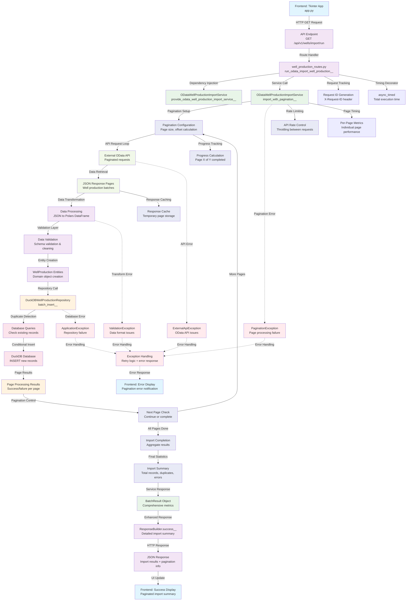

# OData Import Workflow - GET /api/v1/wells/import/run

This workflow shows the advanced OData import system with pagination, external API integration, and comprehensive data processing capabilities.

## Endpoint-Driven Flow Diagram



## Detailed Method Flow

### 1. API Endpoint Entry Point
- **File**: `src/interfaces/api/well_production_routes.py`
- **Method**: `run_odata_import_well_production()`
- **Features**:
  - Query parameter handling for pagination settings
  - Request ID generation and tracking
  - Comprehensive error handling for OData-specific issues

### 2. OData Import Service
- **File**: `src/application/services/odata_well_production_import_service.py`
- **Method**: `import_with_pagination()`
- **Key Features**:
  - Dynamic pagination management
  - Rate limiting to prevent API overload
  - Progress tracking across multiple pages
  - Memory-efficient page processing
  - Error recovery and retry logic

### 3. External OData API Integration
- **Protocol**: OData v4.0
- **Data Source**: Petrofac Production Data API
- **Features**:
  - RESTful API with standardized OData query syntax
  - Pagination support with $skip and $top parameters
  - JSON response format with metadata
  - Authentication and rate limiting compliance

### 4. Pagination Management
- **Page Size**: Configurable (default: 1000 records)
- **Memory Management**: Process one page at a time
- **Progress Tracking**: Real-time completion percentage
- **Error Handling**: Individual page failure recovery

### 5. Data Processing Pipeline
- **Input Format**: OData JSON responses
- **Transformation**: JSON → Polars DataFrame → Domain Entities
- **Validation**: Schema validation, data quality checks
- **Duplicate Handling**: Efficient duplicate detection per page

## Pagination Flow Details

### Query Parameters
- `page_size`: Records per page (default: 1000, max: 5000)
- `max_pages`: Maximum pages to process (default: unlimited)
- `start_page`: Starting page number (default: 0)

### OData Query Construction
```
GET /odata/WellProduction?
  $skip={page * page_size}&
  $top={page_size}&
  $orderby=WellCode,ProductionDate&
  $format=json
```

### Response Structure
```json
{
  "@odata.context": "...",
  "@odata.count": 150000,
  "value": [
    {
      "WellCode": "WELL_001",
      "ProductionDate": "2024-01-01",
      "OilProduction": 1250.5,
      "GasProduction": 2100.0,
      "WaterProduction": 150.2
    }
  ],
  "@odata.nextLink": "..."
}
```

## Advanced Features

### 1. Rate Limiting
- **Request Frequency**: Configurable delay between API calls
- **Adaptive Throttling**: Automatic adjustment based on API response times
- **Backoff Strategy**: Exponential backoff for rate limit errors

### 2. Progress Tracking
```json
{
  "current_page": 15,
  "total_pages": 150,
  "progress_percentage": 10.0,
  "records_processed": 15000,
  "estimated_total": 150000,
  "estimated_completion": "2024-01-01T12:05:30Z"
}
```

### 3. Memory Optimization
- **Page-by-Page Processing**: No accumulation of all data in memory
- **Streaming Inserts**: Direct database insertion per page
- **Garbage Collection**: Explicit cleanup after each page

### 4. Error Recovery
- **Page-Level Retry**: Retry individual failed pages
- **Partial Success**: Continue processing despite individual page failures
- **Error Aggregation**: Collect and report all errors at completion

## Performance Characteristics

- **Concurrency**: Single-threaded sequential page processing
- **Memory Usage**: Constant memory footprint regardless of total records
- **Network Efficiency**: Optimal page size balancing throughput and memory
- **Database Performance**: Batch inserts per page for efficiency

## API Response Examples

### Successful Import Response
```json
{
  "success": true,
  "data": {
    "batch_result": {
      "total_items": 150000,
      "processed_items": 147500,
      "failed_items": 2500,
      "success_rate": 98.33,
      "memory_usage_mb": 125.5
    },
    "pagination_summary": {
      "total_pages": 150,
      "processed_pages": 150,
      "failed_pages": 2,
      "page_size": 1000,
      "average_page_time_seconds": 2.1
    },
    "import_summary": {
      "new_records": 145000,
      "duplicate_records": 2500,
      "error_records": 2500
    },
    "performance": {
      "total_execution_time_seconds": 315.0,
      "average_throughput_per_second": 476.2,
      "api_request_time_seconds": 285.0,
      "database_time_seconds": 30.0
    }
  },
  "message": "OData import completed: 147500 records processed across 150 pages"
}
```

### Pagination Error Response
```json
{
  "success": false,
  "error": {
    "code": "EXTERNAL_API_ERROR",
    "message": "OData API rate limit exceeded on page 45",
    "details": {
      "failed_page": 45,
      "total_pages": 150,
      "records_processed": 44000,
      "retry_after_seconds": 60
    }
  }
}
```

## Error Scenarios

1. **OData API Failures**: Network issues, authentication errors, rate limiting
2. **Pagination Errors**: Invalid page parameters, page size limits
3. **Data Quality Issues**: Schema mismatches, invalid data formats
4. **Memory Pressure**: Large page sizes causing memory issues
5. **Database Constraints**: Unique key violations, foreign key errors

## Business Benefits

- **Large Dataset Handling**: Process millions of records efficiently
- **Memory Efficiency**: Constant memory usage regardless of dataset size
- **Progress Visibility**: Real-time progress updates for long-running imports
- **Error Resilience**: Continue processing despite individual page failures
- **API Compliance**: Respectful API usage with rate limiting and pagination
- **Data Integrity**: Comprehensive duplicate detection and validation
