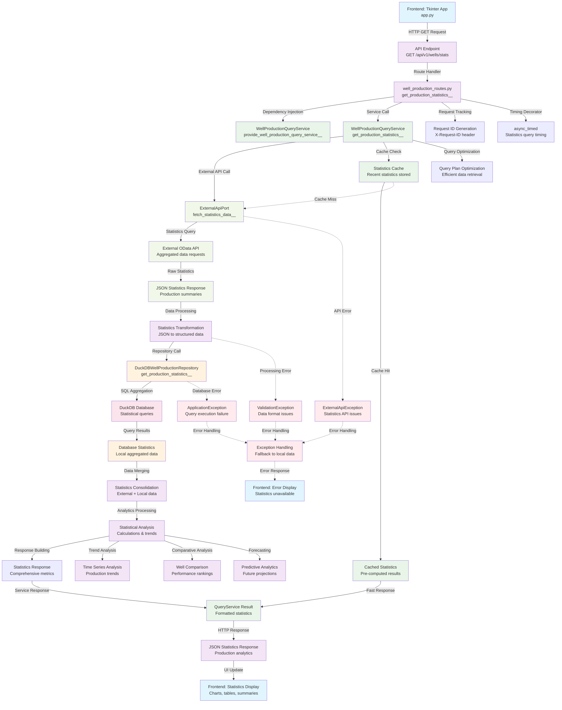

# Statistics Retrieval Workflow - GET /api/v1/wells/stats

This workflow shows the complete flow for retrieving production statistics and analytics data from the Wells API system.

## Endpoint-Driven Flow Diagram



## Detailed Method Flow

### 1. API Endpoint Entry Point
- **File**: `src/interfaces/api/well_production_routes.py`
- **Method**: `get_production_statistics()`
- **Query Parameters**:
  - `date_from`: Start date for statistics period
  - `date_to`: End date for statistics period
  - `field_codes`: Optional field filter
  - `well_codes`: Optional well filter
  - `aggregation_level`: daily, monthly, yearly

### 2. Query Service Processing
- **File**: `src/application/services/well_production_query_service.py`
- **Method**: `get_production_statistics()`
- **Features**:
  - Multi-source data aggregation
  - Statistical calculations
  - Trend analysis
  - Performance comparisons

### 3. External Statistics API
- **Data Sources**:
  - Real-time production data
  - Historical trends
  - Industry benchmarks
  - Forecasting models

### 4. Database Analytics
- **File**: `src/infrastructure/repositories/duckdb_well_production_repository.py`
- **Method**: `get_production_statistics()`
- **SQL Operations**:
  - Aggregation queries (SUM, AVG, COUNT)
  - Time-series analysis
  - Well performance rankings
  - Production efficiency calculations

## Statistics Data Structure

### Request Parameters
```json
{
  "date_from": "2024-01-01",
  "date_to": "2024-12-31",
  "field_codes": ["FIELD_001", "FIELD_002"],
  "aggregation_level": "monthly",
  "include_forecasts": true,
  "include_comparisons": true
}
```

### Response Structure
```json
{
  "success": true,
  "data": {
    "summary": {
      "total_wells": 125,
      "active_wells": 118,
      "total_oil_production": 2500000.5,
      "total_gas_production": 4200000.0,
      "total_water_production": 850000.2,
      "average_daily_oil": 6849.3,
      "production_efficiency": 87.5
    },
    "time_series": {
      "daily": [...],
      "monthly": [
        {
          "period": "2024-01",
          "oil_production": 210000.5,
          "gas_production": 350000.0,
          "water_production": 70000.2,
          "well_count": 125
        }
      ],
      "yearly": [...]
    },
    "well_rankings": [
      {
        "well_code": "WELL_001",
        "rank": 1,
        "total_oil": 15000.5,
        "efficiency_score": 95.2
      }
    ],
    "field_analysis": [
      {
        "field_code": "FIELD_001",
        "well_count": 45,
        "total_production": 1200000.0,
        "average_per_well": 26666.7
      }
    ],
    "trends": {
      "oil_trend": "increasing",
      "gas_trend": "stable",
      "water_trend": "decreasing",
      "efficiency_trend": "improving"
    },
    "forecasts": {
      "next_month_oil": 220000.0,
      "next_quarter_total": 650000.0,
      "confidence_level": 0.85
    }
  },
  "metadata": {
    "calculation_time_seconds": 2.5,
    "data_freshness": "2024-01-01T12:00:00Z",
    "external_api_calls": 3,
    "cache_usage": "partial"
  }
}
```

## Key Analytics Features

### 1. Production Summaries
- Total production by product type (oil, gas, water)
- Average daily/monthly production rates
- Production efficiency metrics
- Well performance rankings

### 2. Time Series Analysis
- Daily, monthly, yearly aggregations
- Trend identification and analysis
- Seasonal pattern recognition
- Production rate changes over time

### 3. Comparative Analysis
- Well-to-well performance comparison
- Field-level production analysis
- Industry benchmark comparisons
- Historical performance trends

### 4. Predictive Analytics
- Short-term production forecasts
- Trend-based projections
- Confidence intervals
- Scenario modeling

## Performance Characteristics

- **Query Optimization**: Efficient SQL aggregation queries
- **Caching Strategy**: Statistics cached for 15 minutes
- **Data Freshness**: Real-time + historical data combination
- **Response Time**: < 3 seconds for standard statistics
- **Memory Usage**: Optimized for large dataset aggregations

## Error Scenarios

1. **External API Failures**: Fallback to local database statistics
2. **Database Query Errors**: Simplified statistics with error indicators
3. **Data Quality Issues**: Partial statistics with quality warnings
4. **Cache Failures**: Direct computation without caching
5. **Timeout Errors**: Progressive timeout with partial results

## Business Value

- **Production Monitoring**: Real-time production tracking
- **Performance Analysis**: Well and field efficiency metrics
- **Decision Support**: Data-driven production optimization
- **Trend Analysis**: Historical patterns and future projections
- **Operational Intelligence**: Actionable insights for field operations
